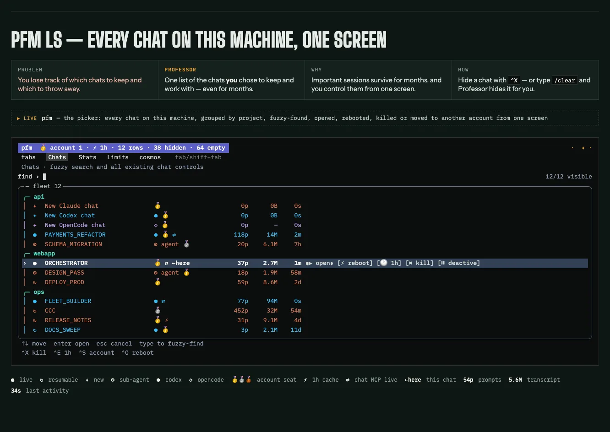
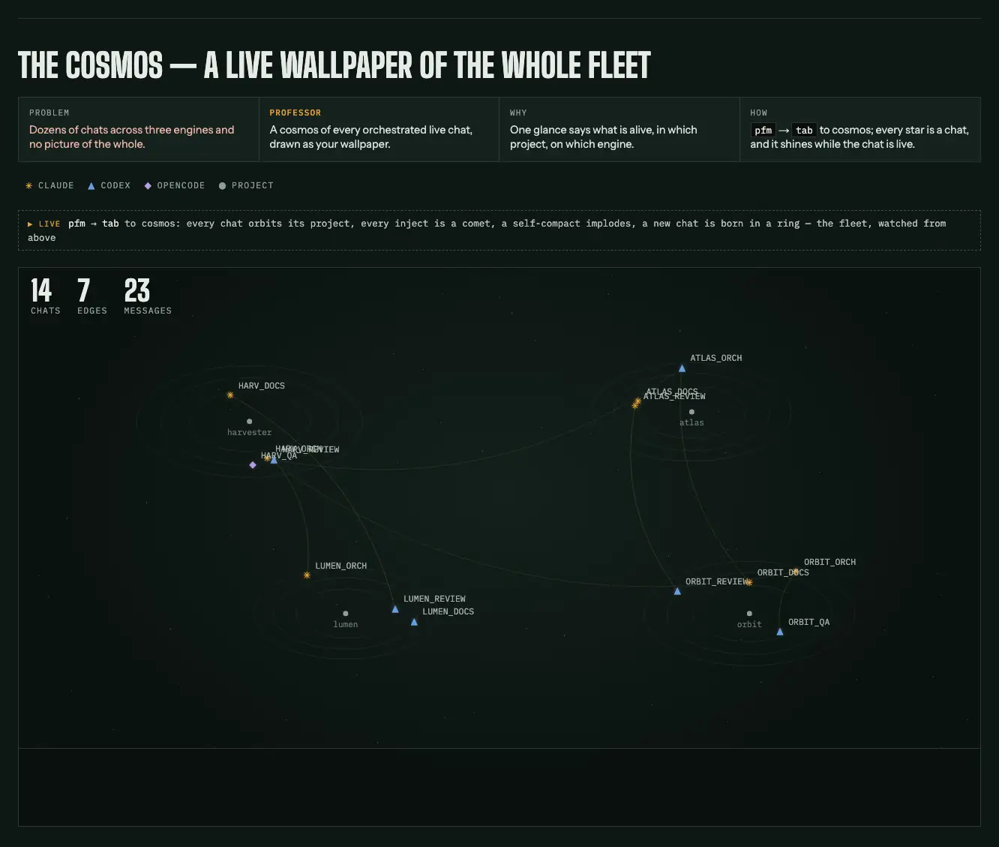
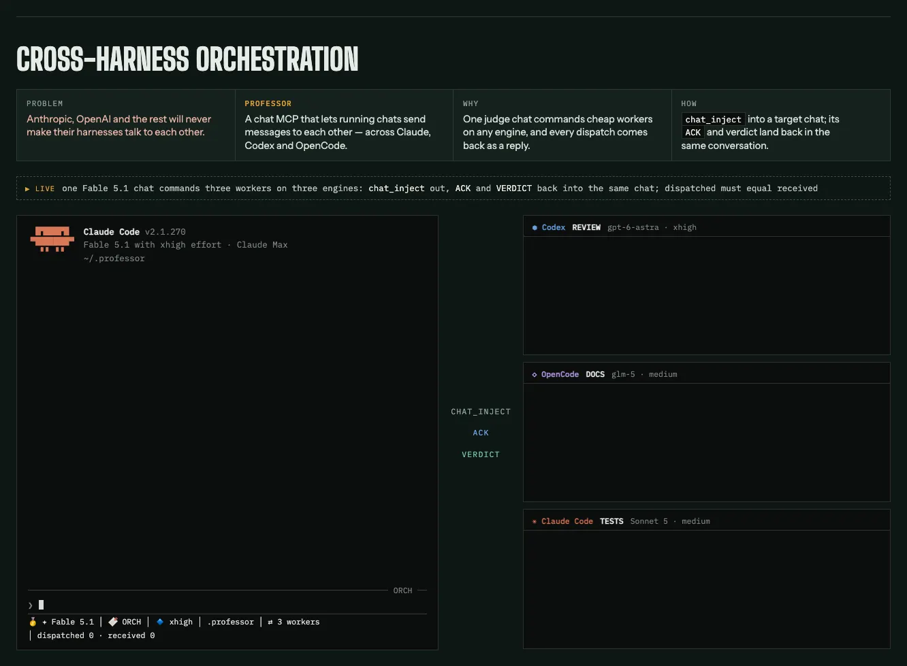
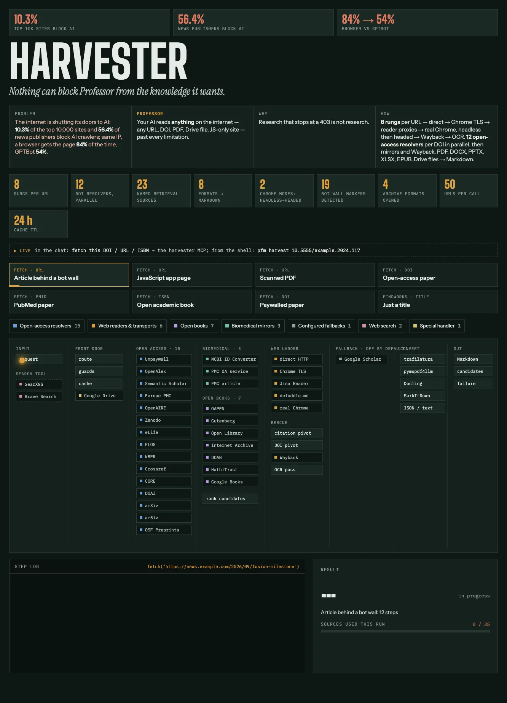
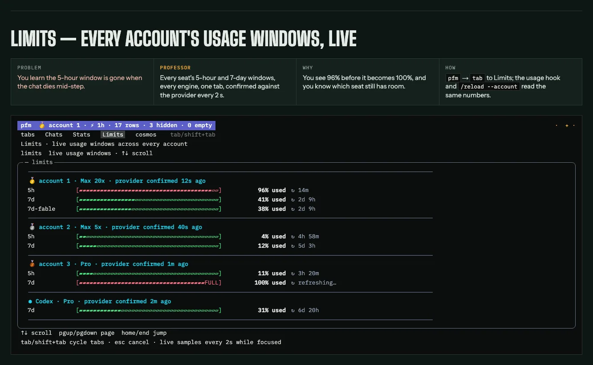
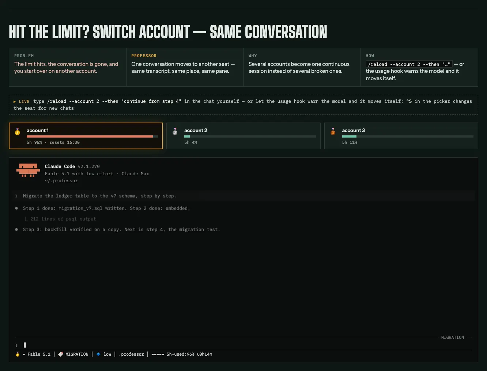

<h1 align="center">Professor</h1>

<p align="center">
  <strong>An LLM-harness fleet boost framework.</strong><br>
  Turns the AI coding chats on your machine into a disciplined engineering team —<br>
  one you can see, message, and hold to the rules.
</p>

<p align="center">
  <a href="https://github.com/rezzminator/professor/releases"></a>
  <a href="LICENSE"></a>
  
  
  
</p>

<p align="center">
  <a href="#six-things-you-can-watch-it-do">Watch it work</a> ·
  <a href="#install">Install</a> ·
  <a href="#the-discipline-layer-templates">Discipline layer</a> ·
  <a href="#the-fleet-cli-pfm">Fleet CLI</a> ·
  <a href="#workflows-workflows">Workflows</a> ·
  <a href="docs/BLUEPRINT.md">Blueprint</a>
</p>

<h2 align="center">Professor is a complete, integrated toolbox for everything you want to do — that Anthropic, OpenAI <em>or anyone else</em> will <em>never</em> give you.</h2>

<p align="center">
  <br>
  <sub>Linus Torvalds · Aalto University, June 2012</sub>
</p>

A fleet controller and a discipline layer for **Claude Code, Codex, and OpenCode** — chats that talk to each other, agents that follow the rules, and a harvester that reads what the web won't show a bot.

## Why Professor?

You already run more than one AI chat. They cannot see each other, they forget the rules the moment context compacts, and a growing share of the web answers them with a 403. Professor is the layer that fixes all three — without touching what your harness is, only what it does.

| | Without Professor | With Professor |
| --- | --- | --- |
| Many chats, many accounts | Scattered terminal tabs; a closed tab is a lost chat | One picker — every chat on every harness, live or resumable |
| One chat needs another | You copy-paste between windows | `chat_inject` — a signed turn, delivered and acknowledged |
| The rules, after compaction | Whatever the prompt still remembers | Hooks that refuse, with the unlock steps in the refusal |
| A bot-blocked page | A 403, or an empty page reported as content | A seven-rung fetch ladder; a block is reported as a block |
| Claude and Codex rules | Two files that drift apart | One `CLAUDE.md`, compiled mirrors, drift fails the check |
| An account hits its limit | Start over in a new chat | `/reload --account 2` — same pane, same history |

---

## Six things you can watch it do

Every transcript below is real output from this repository, redacted only of names.

### 1. See the fleet

<p align="center">
  
</p>

> `pfm ls`: every AI chat on the machine — Claude Code, Codex (⬢), and OpenCode — across accounts (🥇🥈), grouped by repo, live (●), resumable (↻), or agent-run (⚙). `⇄` marks chats that talk to other chats; `←here` is the one you are sitting in; `✦` opens a new one on any harness. Pick one, attach, or fire it a goal without ever attaching. A chat that scrolled off a closed terminal tab is not gone — it is a resumable transcript, and now somebody can find it.

`tab` once more and the same fleet is drawn as a sky:

<p align="center">
  
</p>

> Every project is a star its chats orbit; a spawned chat rises as a moon at its parent's angle, so lineage is visible in the sky itself. When chats talk to each other the sky draws an edge between them, read from a durable comms ledger — an edge is a fact, not a guess. The chronoscope replays the last 24h, and a chat that is dead now still renders as the ghost it was back then.

### 2. Chats that talk to each other

Two panes, two harnesses. You type one line into the Claude chat on the left; the Codex chat on the right receives it as a signed turn and gets to work.

<p align="center">
  
</p>

> The footer on the Codex side is the signature: who spoke (`sid 0a98b7fe`) and the exact command to answer them. A message no sender could be derived for is refused, never delivered anonymously.

`pfm chat inject` is what the Claude chat called — it types a real, signed turn into another chat's pane — under a per-target lock, safe against a busy target (`--force-now`) and shell-hostile payloads (`--file`). `pfm chat ask` waits for the answer, with named exit codes: `0 done · 2 usage · 3 chat dead · 4 no such chat · 5 answer timed out · 6 message not delivered · 7 answered, but another message reached the chat mid-wait`. The same verbs are an MCP server, so an agent can spawn, message, read, and retire other chats across all three harnesses — and `issue_servicedesk` lets it file a bug against its own host tool.

### 3. Rules that bite

A subagent tries to `Edit` a file under `.claude/`. The PreToolUse guard answers:

```text
DENIED — infra edits route through /pcm: open this session's gate from the repo root …
Do NOT route around this by disabling the hook or editing infra outside /pcm.
```

The refusal carries its own unlock steps. That is one of 26 mandatory rules every install ships with: only `gitter` writes git; fix loops cap at three attempts, then `BLOCKED-DEFERRED`; read-only mappers (`tracer`) are separated from judges (`reviewer`); and **every check names what its own broken state reports** — a gate that says "fine" when healthy and when broken is a coincidence detector.

### 4. Read what the web hides from bots

About one in ten of the world's top 10,000 websites now tells AI crawlers to stay out — among news publishers, more than half (HasData AI Crawler Block Index, July 2026). Harvester fetches the way a reader's browser does and climbs a seven-rung ladder — direct → Chrome-fingerprint TLS → reader proxy → extractor → headless-then-headed browser → Wayback → OCR — until it holds real content:

<p align="center">
  
</p>

A block is reported as a block and an app shell is never stored as the page — a failure names every source it checked, never an empty success. DOIs, ISBNs, PMIDs and PMCIDs route through twelve open-access resolvers in parallel; `pfm harvest ask -p "…" <sources>` feeds the full cached artifacts to a Claude or Codex ask engine, failed sources kept visible as receipts. The whole surface is also an MCP server. The browser rung never solves anything interactive.

### 5. One contract, three runtimes

```text
$ pfm codex build .
$ head -1 AGENTS.md
<!-- Generated by pfm codex build from CLAUDE.md; do not edit — edit the source, then re-run: pfm codex build -->
$ pfm codex check .
CODEX CHECK PASS
```

`CLAUDE.md` compiles to `AGENTS.md`; `.claude/**` compiles to `.codex/**` and `.opencode/**`; global agents' `.toml` twins compile into pfm's own generated directory under the pfm home, linked into `~/.codex/agents/`. Every mirror is generated, never tracked — a fresh clone has none of them until its compiler runs. The Stop hook recompiles the mirrors and a drifted mirror fails the check, so the three harnesses can never disagree about the law. Even the verification engine is one TypeScript source compiled for both the Claude Workflow runtime and the Codex SDK.

### 6. Reload without losing the conversation

Every seat's windows on one tab, confirmed against the provider every two seconds — you see 96% before it becomes 100%:

<p align="center">
  
</p>

Account 🥇 is at 96% of its 5-hour window. The usage hook warns the chat mid-task; it finishes the step in flight and moves the conversation to 🥈 itself — same pane, same history:

<p align="center">
  
</p>

> The red banner is the usage hook — it reaches the model before the limit does. `/reload` typed by a human goes through a hook too, before the model sees it, so the reboot never spends a turn.

The running chat reboots in place — same pane, same history, new account, model, or effort. `--then "prompt"` hands the baton unattended; `/reload` typed by a human runs through a hook without spending a model turn; `/handoff --branch` carries the full context into a detached successor.

---

## Install

Two independent halves; adopt either without the other.

- **`pfm`**, the fleet CLI — one Go binary, touches only your `$HOME`. Binary or source: [INSTALL.md](INSTALL.md).
- **The discipline layer** — cloned, then scaffolded into your repo through an interview:

```bash
REPO=rezzminator/professor
TAG=$(git ls-remote --tags --sort=-v:refname "https://github.com/${REPO}.git" 'v*' \
  | grep -v '\^{}' | head -1 | sed 's#.*/##')
git clone "https://github.com/${REPO}.git" "$HOME/.professor"
git -C "$HOME/.professor" checkout "$TAG"
cat "$HOME/.professor/docs/SETUP.md"      # the install interview — start here
```

The checkout is pinned to the latest semantic version tag. A maintainer checkout also runs `git config core.hooksPath .githooks` so `pfm doctor` reports `pre-push gate=armed`. Upgrading? Follow the [update workflow](INSTALL.md#updating): `pfm update check` reports `UPDATED / NEW / GONE-UPSTREAM / LOCAL-DELETED` with the exact diff, and `pin` / `ignore` / `drop` record your decision — pfm never rewrites a project file after init.

> [!WARNING]
> **Read before opting in:** `pfm` defaults Claude to bypass mode and Codex to approval bypass; machine and per-account configuration can select the prompted posture. Both MCP servers ship disabled. The trade-off is deliberate and documented, not hidden.

---

## The discipline layer (`templates/`)

Clone it into a repo and you get the complete agent, command, hook, script, and `CLAUDE.md` template set. `docs/SETUP.md` walks an interview that substitutes your project's names into every placeholder; `docs/PLACEHOLDERS.md` is the substitution law. Every template is the live source file verbatim — never a skeleton.

The single idea underneath it is the **honest-looking absence** — an instrument that answers "nothing found" both when nothing is there and when the instrument itself is broken. The rules say it out loud:

> An empty enumeration is never a verdict.

- **One agent writes git.** `gitter` runs six named phases (SETUP, COMMIT, MERGE, PUSH, PULL, TAG). No other agent commits.
- **Guarded files.** `.claude/**` and every `CLAUDE.md` sit behind `/pcm` plus a session that has read the quality-prompt contract.
- **The judge is never the thing being judged.** Verdicts are read from disk, never from a brief that asserts green.
- **The flight pipeline.** `/flights:spec` turns a batch of work into one self-contained task file per executor; one of the `/flights:orchestrate-*` commands runs a fresh executor per file and verifies every return against the diff; the landing runs the standing checks once, sends each hard task's diff to a cold `reviewer`, and leaves the commit to `gitter`. `/flights:audit` re-reads the whole flight from its own artifacts, never from what an agent said it did.
- **The persona is load-bearing.** The Professor prompt replaces the vendor system prompt; the vendor baselines are pinned by sha256 so `pfm doctor` reports `MATCHES / DRIFT / CHECK FAILED / CANNOT CAPTURE` — never silence.

Optional roles ship for teams that want them — `/officer`, `/mentor`, `/marketer` — along with a legal skill shelf. **The philosophy lives in [docs/BLUEPRINT.md](docs/BLUEPRINT.md).**

---

## The fleet CLI (`pfm/`)

One Go binary with embedded installer assets. Beyond the six moments above:

- **Limits, honestly.** The `Limits` tab shows every provider window on the box; a provider it cannot reach never renders as a 0% bar — the panel says `no usage source registered` instead.
- **Crash-safety by construction.** `reap`, `archive`, `heal`, and `install` default to a dry run, and the dry run **is** the apply's preview. `heal` backs up the store before it deletes a row.
- **Headless exec.** `pfm headless exec` is one scriptable interface for Claude and OpenCode; `--engine codex` also routes to OpenCode. Prompt, system prompt, schema, and timeout go in; normalized results or native streams come out. See [headless README](pfm/internal/headless/README.md).
- **Housekeeping.** `doctor` runs the dependency registry and fleet DB checks; `tokens` attributes spend per agent; `context-meter` prices every prompt surface; `statusline` renders identity, session and spend; `codex build|check` is the single writer of the Codex mirror.
- **Editor.** `pfm install --vscode` installs the Professor VS Code extension — visible as **Professor** in the Extensions view and a **Professor** entry in the terminal `+` dropdown — and makes the `PFM` settings profile (its own icon and colour) the default, so each new integrated terminal opens at the fleet picker. To open a Professor terminal, press Ctrl+Shift+Alt+T (macOS: Cmd+Shift+Alt+T), run **Professor: New Chat Terminal**, or pick **Professor** from the terminal `+` dropdown — all three give the next icon and colour; the default `+` terminal is `PFM`.

<details>
<summary><strong>Requirements</strong> — Linux or macOS, <code>tmux</code>, Go 1.24.13+ for source builds</summary>

From `pfm doctor`'s own registry: Linux or macOS, `amd64` or `arm64`, plus `tmux` ≥ 1.8, `git`, `sh`, `bash`, `zsh`, and `sleep`; `setsid` on Linux, `ps`/`lsof`/`launchctl` on macOS. Go **1.24.13 or newer** for source builds and `pfm update`. The `claude` and `codex` CLIs are optional diagnostics. The harvester provisions its own pinned `uv` and CPython (about 3.1 GB to download and 5.8 GB on disk for the current Linux `amd64` lock), skippable with `--skip-harvest`; themes with `--skip-themes`; the Codex probe with `--skip-engine codex`. Run the [dry preview](INSTALL.md#preview-optional-components-and-harvest-footprint) before applying. Harvester configuration: [harvest README](pfm/internal/harvest/README.md).

</details>

---

## Workflows (`workflows/`)

- **deep-rr** (`workflows/deep-rr/`) — background research that returns a cited report: a scout swarm, a brainer steering the crawl, quote-pinned claims audited mechanically, lineage clustering so corroboration counts independent sources. Compiled for the Claude Workflow runtime. Start at [workflows/deep-rr/README.md](workflows/deep-rr/README.md).

---

## Origin

Extracted from a live production monorepo, not designed in the abstract. Every rule here exists because something went wrong without it — the gate that reads disk instead of chat exists because an agent once claimed green; the scoped-commit rule exists because two concurrent commits once swallowed each other's files; the prevention step exists because the same bug class shipped twice. The characters exist because a generic agent wasn't good enough to argue with.

Built by [@rezzminator](https://github.com/rezzminator). Issues and PRs welcome.

**License:** MIT
